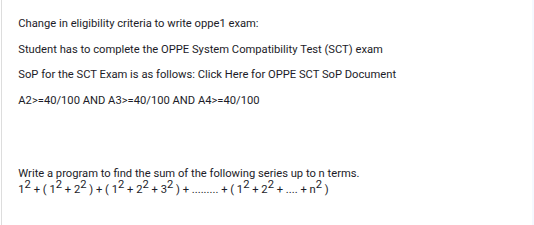
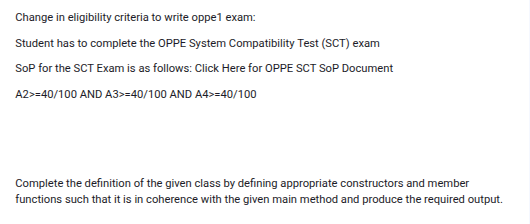

# GRPA Week 2

## Question 1



[**Solution**](../Week%202/SeriesSum.java)

```java
import java.util.*;

public class SeriesSum {
  public static void main(String[] args) {
    Scanner sc = new Scanner(System.in);
    
    int n = sc.nextInt();

    int sum = 0;

    for (int i = 1; i <= n; i++) {
      int subSum = 0;

      for (int j = 1; j <= i; j++) {
        subSum += j * j;
      }

      sum += subSum;
    }

    System.out.println(sum);
  }
}
```

## Question 2



[**Sollution :**](../Week%202/FClass1.java)

```java
import java.util.Scanner;

class Employee {
    String ename;
    String eid;
    String edept;

    public Employee() {
        ename = "guest";
        eid = "not assigned";
        edept = "not assigned";
    }

    public Employee(String name, String id, String dept) {
        ename = name;
    }

    public void copyDept(Employee other) {
        this.edept = other.edept;
    }

    public void displayDetails() {
        System.out.println("ename : " + ename);
        System.out.println("eid : " + eid);
        System.out.println("edept : " + edept);
    }
}

public class FClass1 {
    public static void main(String args[]) {
        Scanner s = new Scanner(System.in);
        Employee e1 = new Employee();

        // Enter name of the employee
        String name = s.nextLine();

        // Enter id of the employee
        String id = s.nextLine();

        // Enter department of the employee
        String dept = s.nextLine();

        Employee e2 = new Employee(name, id, dept);

        e1.copyDept(e2);
        // Copies the department name of e2 into e1's department name.

        e1.displayDetails();
    }
}

```

## Question 3


[**Sollution**](../Week%202/FClass2.java)

```java
import java.util.*;

class Employee {
    String eid;
    String ename;
    String eprojects[];

    public Employee(String id, String name, String[] projects) {
        this.eid = id;
        this.ename = name;
        this.eprojects = projects.clone();
    }

    public Employee(Employee e) {
        this.eid = e.eid;
        this.ename = e.ename;
        this.eprojects = e.eprojects.clone();
    }

    public void display() {
        System.out.println("id:" + this.eid);
        System.out.println("name:" + this.ename);
        System.out.println("projects:");

        for (String project : this.eprojects) {
            if (project != null) {
                System.out.print(project + ":");
            }
        }
        System.out.println();
    }

    public void mutator() {
        this.ename = "Mr " + this.ename;
        this.eprojects[0] = null;
    }

}

public class FClass2 {
    public static void main(String[] args) {
        Scanner s = new Scanner(System.in);
        String project[] = { "P001", "P002", "P003" };

        // Enter the ID of the employee
        String id = s.nextLine();

        // Enter the name of the employee
        String name = s.nextLine();

        // Create an Employee object using the parameterized constructor
        Employee e1 = new Employee(id, name, project);

        // Create a copy of the Employee object using the copy constructor
        Employee e2 = new Employee(e1);

        // Mutate the data of the first employee
        e1.mutator();

        // Display the details of the second employee
        e2.display();
    }
}
```
